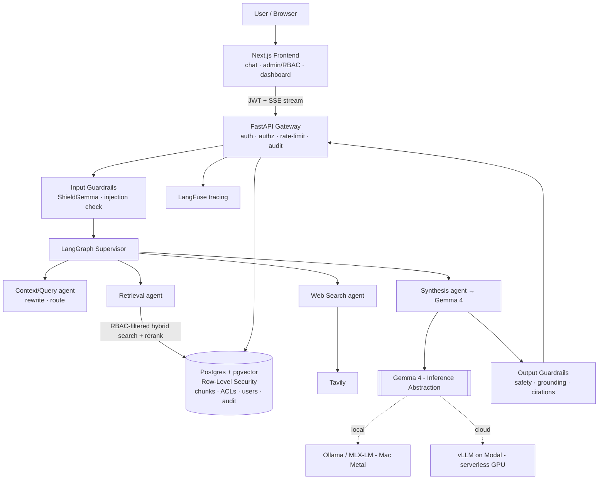

<div align="center">

# 🛡️ Enterprise Agentic RAG

**A context-aware, multi-agent RAG platform with document-level RBAC, layered guardrails, and a locally fine-tuned Gemma 4 - designed to run securely on a laptop and demo cheaply in the cloud.**

[](../../actions)
[](LICENSE)
[](backend/pyproject.toml)
[-8E44AD.svg)](docs/adr/0002-local-gemma-on-apple-silicon.md)

</div>

---

## Why this project

Most RAG demos answer questions over a pile of PDFs. Enterprises can't ship that, because retrieval **leaks data**: anyone who can ask a question can extract any document the index can see. This project treats RAG as a production system:

- 🔐 **RBAC where it actually matters - retrieval.** Document access is enforced by **Postgres Row-Level Security**, so the database physically cannot return a chunk the caller isn't cleared for - even if the application query is buggy. This kills the #1 enterprise RAG risk: exfiltration.
- 🤖 **Multi-agent & context-aware.** A LangGraph supervisor routes each query through context-rewrite → retrieval / live web → grounded synthesis, with conversation memory.
- 🧯 **Layered guardrails.** ShieldGemma input/output safety, prompt-injection checks, and a grounding/citation validator that refuses rather than hallucinates.
- 🦾 **Local, open model + LoRA.** Gemma 4 runs on-device via Ollama/MLX (Apple Metal); a LoRA adapter teaches it strict citation format and faithful refusals. No proprietary API required.
- 🚀 **Two profiles, one codebase.** Runs **fully local & air-gappable** on a MacBook, and deploys as a **cheap, scale-to-zero cloud demo** - switched by env vars.

## Architecture



## Runtime profiles

| Aspect | Local / Secure (MacBook) | Cloud / Demo (recruiters) |
|---|---|---|
| Gemma 4 | Ollama / MLX-LM (Metal) | vLLM on Modal (serverless GPU) |
| Database | Postgres + pgvector (Docker) | Neon / Supabase (managed) |
| Web search | off / self-hosted | Tavily (live) |
| Hosting | `make api` / `make web` | Vercel + Modal |
| Cost | $0, air-gappable | ~$0 idle (scale-to-zero) |

## Quickstart (local)

**Prereqs:** [`uv`](https://docs.astral.sh/uv/), Node 22 + `pnpm`, [Ollama](https://ollama.com), and Docker Desktop (for Postgres).

```bash
make pull-model        # ollama pull gemma4
make install           # backend (uv) + frontend (pnpm)
make up                # Postgres + pgvector  (needs Docker running)
cp .env.example .env

make api               # FastAPI  → http://localhost:8000/docs
make web               # Next.js  → http://localhost:3000
```

Smoke-test the model path without the DB:

```bash
curl -s localhost:8000/api/health | jq      # {"status":"ok","llm_reachable":true,"db_reachable":...}
```

> No Docker? Any Postgres 16+ with the `pgvector` extension works - point `DATABASE_URL` at it
> (`CREATE EXTENSION vector;`) and skip `make up`.

## Ingest documents and chat (Phase 1 + 2)

```bash
make migrate                              # schema + pgvector indexes + Row-Level Security policies
make seed                                 # demo users: viewer / analyst / admin (password: demo)
make corpus                               # download a few sample arXiv PDFs (or drop your own in backend/data/raw)
make ingest ROLES=viewer,analyst,admin    # PDF → chunk → BGE-M3 embed → pgvector, tagged with these roles
```

**Or just drop files and let the model tier them.** Instead of tagging roles by
hand, the ingester can read each document and assign its access tier (which maps
to `allowed_roles`) automatically:

```bash
make classify       # preview: print the proposed tier + reason per file, write nothing
make ingest-auto    # commit: ingest backend/data/raw with the AI-assigned tiers
```

Classification **fails closed** - an unreadable document, a model outage, or
high-confidence PII (SSNs, card numbers) lands a file in the most restrictive
tier (admin-only) rather than the most open one, so a misjudgement never leaks.
It is a convenience, not the security boundary (RLS is); `make classify` is the
human-review step, and the tier, rationale, and an `auto_classified` flag are
stored on each document row for audit. Explicit `--roles` still overrides.

**Ingest a HuggingFace dataset (not just PDFs).** Many corpora ship as dataset
rows. The same chunk -> embed -> RLS-tagged pipeline ingests them, streaming so
`--limit` never has to materialise the whole set:

```bash
# 100 medical patient-doctor conversations, tagged clinician-only (analyst/admin)
make hf-ingest                              # defaults to Postzeun/Patient-Doctor
make hf-ingest DATASET=org/name LIMIT=200 ROLES=admin SENSITIVITY=restricted
```

That dataset is line-delimited (one line per row), so the ingester groups
consecutive lines back into whole conversations via `--record-prefix` before
chunking - otherwise each row would become a meaningless few-character chunk.
Medical records make the RBAC story concrete: tag them `analyst,admin` and a
`viewer` is refused every chunk while a clinician role retrieves and cites them.

Open `http://localhost:3000/chat`, **sign in**, and ask. Your roles come from the login (a signed
JWT), not the request - answers are grounded in the retrieved chunks with inline `[n]` citations,
and the model refuses when the documents your roles can see do not support an answer.

**RBAC at the retrieval layer (the headline).** Tag documents for different roles, and Postgres
**Row-Level Security** filters them per request - a `viewer` cannot retrieve, or even rank
against, an `admin`-only chunk:

```bash
cd backend
uv run python -m app.ingestion.cli --input data/raw/public.pdf     --source-id demo --roles viewer,analyst,admin --sensitivity public
uv run python -m app.ingestion.cli --input data/raw/restricted.pdf --source-id demo --roles admin                --sensitivity restricted
# sign in as viewer, ask about the restricted doc → "I don't have enough information ..."  (no leak)
# sign in as admin,  ask the same question        → grounded answer with a [n] citation
```

The guarantee is enforced by the database, not the app: a raw `SELECT * FROM chunks` with no
WHERE clause returns only the rows the caller's roles permit. Retrieval itself is hybrid (dense
pgvector + sparse full-text, fused with RRF) then a BGE cross-encoder rerank.
See [ADR-0005](docs/adr/0005-hybrid-retrieval.md) and [ADR-0006](docs/adr/0006-rls-enforcement.md).

**Multi-agent and context-aware (Phase 3).** Each query runs through a LangGraph supervisor:
a context agent rewrites the latest message into a standalone query using the conversation (so
"and what is *its* codename?" resolves correctly), routes to retrieval and - when warranted and
the role permits - a Tavily web-search agent, then a synthesis agent answers with citations. The
UI shows the rewritten query and whether web search ran. Web search is optional: without
`TAVILY_API_KEY` the graph degrades to documents-only. See
[ADR-0007](docs/adr/0007-agentic-orchestration.md).

**Layered guardrails (Phase 4).** Input is screened for prompt-injection / jailbreaks and
blocked before any retrieval ("ignore all previous instructions ..." never reaches the model);
output is checked so every inline `[n]` citation maps to a real source and scanned for PII, with
verdicts surfaced in the UI. Heavy options (ShieldGemma, Presidio, a trained classifier) are
drop-in points, not dependencies. See [ADR-0008](docs/adr/0008-layered-guardrails.md).

## Repository layout

```
backend/    FastAPI · LangGraph agents · retrieval · guardrails · RBAC   (Python 3.12, uv)
frontend/   Next.js chat + admin/RBAC + dashboard                        (TS, pnpm)
ml/         LoRA fine-tuning · datasets · RAGAS eval · model cards
infra/      docker-compose · Helm chart · Terraform  (IaC as artifacts)
docs/       architecture · ADRs · threat model · runbook
```

## Roadmap

- [x] **Phase 0** - Scaffold, inference abstraction (Gemma 4 verified), CI, docs
- [x] **Phase 1** - Core RAG: ingestion → pgvector → hybrid retrieval + rerank → grounded, cited chat
- [x] **Phase 2** - RBAC via Postgres RLS: JWT auth, roles enforced in-database, append-only audit log
- [x] **Phase 3** - LangGraph agents: context-rewrite + retrieval + permission-gated web search
- [x] **Phase 4** - Layered guardrails: injection blocking, grounding/citation validation, PII scan
- [ ] **Phase 5** - LoRA fine-tune: dataset generator + MLX config + eval harness + model card ready; training run pending
- [ ] **Phase 6** - Helm + Terraform + Modal artifacts, CI eval gate, LangFuse hook ready (CI-validated); live cloud deploy pending

## Documentation

- [Architecture](docs/architecture.md) · [Threat model](docs/threat-model.md) · [Runbook](docs/runbook.md)
- ADRs: [local Gemma on Apple Silicon](docs/adr/0002-local-gemma-on-apple-silicon.md) · [pgvector + RLS for RBAC](docs/adr/0003-pgvector-rls-for-rbac.md) · [IaC as artifact](docs/adr/0004-iac-as-artifact.md) · [hybrid retrieval](docs/adr/0005-hybrid-retrieval.md) · [RLS enforcement](docs/adr/0006-rls-enforcement.md) · [agentic orchestration](docs/adr/0007-agentic-orchestration.md) · [layered guardrails](docs/adr/0008-layered-guardrails.md)

## License

[Apache 2.0](LICENSE) - matching Gemma 4's own license.
