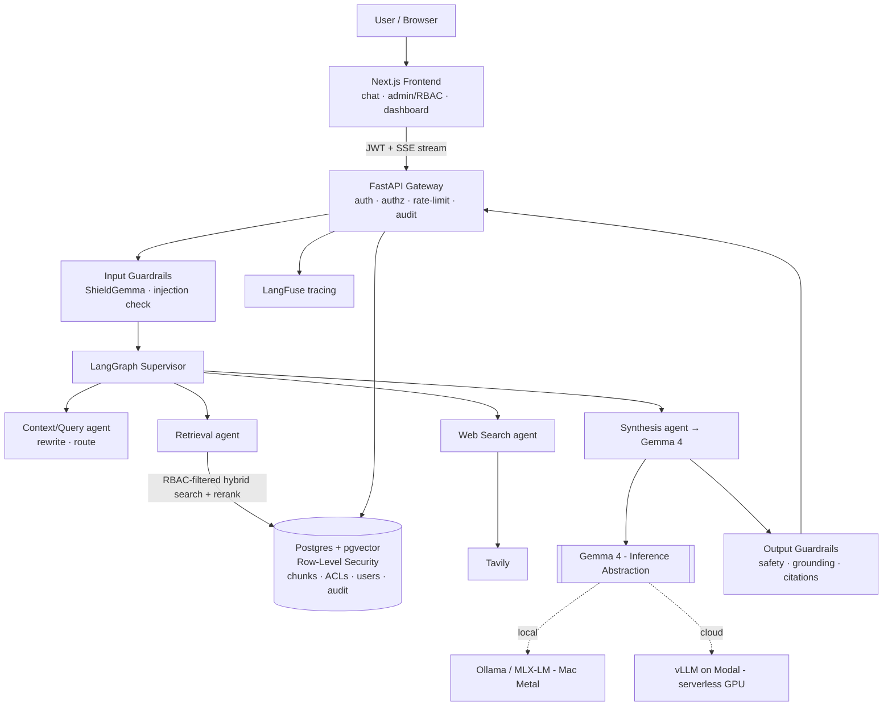

<div align="center">

# 🛡️ Enterprise Agentic RAG

**A context-aware, multi-agent RAG platform with document-level RBAC, layered guardrails, and a locally fine-tuned Gemma 4 - designed to run securely on a laptop and demo cheaply in the cloud.**

[](../../actions)
[](LICENSE)
[](backend/pyproject.toml)
[-8E44AD.svg)](docs/adr/0002-local-gemma-on-apple-silicon.md)

</div>

---

## Why this project

Most RAG demos answer questions over a pile of PDFs. Enterprises can't ship that, because retrieval **leaks data**: anyone who can ask a question can extract any document the index can see. This project treats RAG as a production system:

- 🔐 **RBAC where it actually matters - retrieval.** Document access is enforced by **Postgres Row-Level Security**, so the database physically cannot return a chunk the caller isn't cleared for - even if the application query is buggy. This kills the #1 enterprise RAG risk: exfiltration.
- 🤖 **Multi-agent & context-aware.** A LangGraph supervisor routes each query through context-rewrite → retrieval / live web → grounded synthesis, with conversation memory.
- 🧯 **Layered guardrails.** ShieldGemma input/output safety, prompt-injection checks, and a grounding/citation validator that refuses rather than hallucinates.
- 🦾 **Local, open model + LoRA.** Gemma 4 runs on-device via Ollama/MLX (Apple Metal); a LoRA adapter teaches it strict citation format and faithful refusals. No proprietary API required.
- 🚀 **Two profiles, one codebase.** Runs **fully local & air-gappable** on a MacBook, and deploys as a **cheap, scale-to-zero cloud demo** - switched by env vars.

## Architecture



## Runtime profiles

| Aspect | Local / Secure (MacBook) | Cloud / Demo (recruiters) |
|---|---|---|
| Gemma 4 | Ollama / MLX-LM (Metal) | vLLM on Modal (serverless GPU) |
| Database | Postgres + pgvector (Docker) | Neon / Supabase (managed) |
| Web search | off / self-hosted | Tavily (live) |
| Hosting | `make api` / `make web` | Vercel + Modal |
| Cost | $0, air-gappable | ~$0 idle (scale-to-zero) |

## Quickstart (local)

**Prereqs:** [`uv`](https://docs.astral.sh/uv/), Node 22 + `pnpm`, [Ollama](https://ollama.com), and Docker Desktop (for Postgres).

```bash
make pull-model        # ollama pull gemma4
make install           # backend (uv) + frontend (pnpm)
make up                # Postgres + pgvector  (needs Docker running)
cp .env.example .env

make api               # FastAPI  → http://localhost:8000/docs
make web               # Next.js  → http://localhost:3000
```

Smoke-test the model path without the DB:

```bash
curl -s localhost:8000/api/health | jq      # {"status":"ok","llm_reachable":true,...}
```

## Repository layout

```
backend/    FastAPI · LangGraph agents · retrieval · guardrails · RBAC   (Python 3.12, uv)
frontend/   Next.js chat + admin/RBAC + dashboard                        (TS, pnpm)
ml/         LoRA fine-tuning · datasets · RAGAS eval · model cards
infra/      docker-compose · Helm chart · Terraform  (IaC as artifacts)
docs/       architecture · ADRs · threat model · runbook
```

## Roadmap

- [x] **Phase 0** - Scaffold, inference abstraction (Gemma 4 verified), CI, docs
- [ ] **Phase 1** - Core RAG: ingestion → pgvector → hybrid retrieval + rerank → chat
- [ ] **Phase 2** - RBAC via Postgres RLS, audit log, admin UI
- [ ] **Phase 3** - LangGraph multi-agent + memory + Tavily web search
- [ ] **Phase 4** - Guardrails (ShieldGemma, grounding, injection, PII)
- [ ] **Phase 5** - LoRA fine-tune (MLX), RAGAS before/after, model card
- [ ] **Phase 6** - Eval gate, LangFuse, cloud demo, Helm/Terraform artifacts

## Documentation

- [Architecture](docs/architecture.md) · [Threat model](docs/threat-model.md) · [Runbook](docs/runbook.md)
- ADRs: [local Gemma on Apple Silicon](docs/adr/0002-local-gemma-on-apple-silicon.md) · [pgvector + RLS for RBAC](docs/adr/0003-pgvector-rls-for-rbac.md) · [IaC as artifact](docs/adr/0004-iac-as-artifact.md)

## License

[Apache 2.0](LICENSE) - matching Gemma 4's own license.
