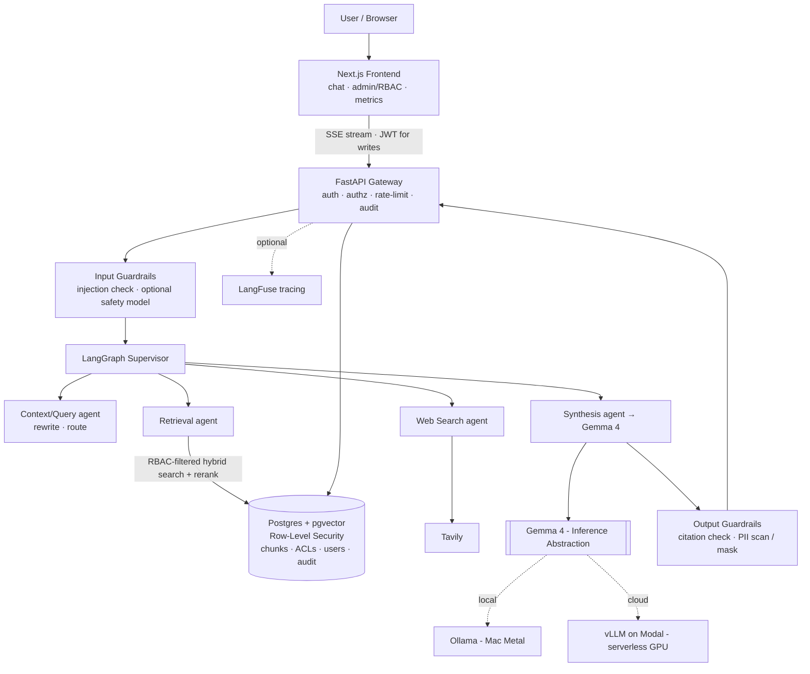

<div align="center">

# 🛡️ Enterprise Agentic RAG

**A context-aware, multi-agent RAG platform with document-level RBAC enforced by Postgres Row-Level Security, layered guardrails, and a local Gemma 4 served by Ollama. It runs on a laptop; a smaller hosted demo runs on Vercel.**

[](../../actions)
[](LICENSE)
[](backend/pyproject.toml)
[-8E44AD.svg)](docs/adr/0002-local-gemma-on-apple-silicon.md)

</div>

---

## Why this project

Most RAG demos answer questions over a pile of PDFs. Enterprises can't ship that, because retrieval **leaks data**: anyone who can ask a question can extract any document the index can see. This project treats RAG as a production system:

- 🔐 **RBAC where it actually matters - retrieval.** Document access is enforced by **Postgres Row-Level Security**, so the database physically cannot return a chunk the caller isn't cleared for - even if the application query is buggy.
- 🤖 **Multi-agent & context-aware.** A LangGraph supervisor routes each query through context-rewrite → retrieval / live web → grounded synthesis, with conversation memory.
- 🧯 **Layered guardrails.** Prompt-injection blocking on input, a citation check that flags any `[n]` pointing at a source that was not retrieved, PII detection or masking on output, and an optional input safety-classifier hook (off unless `GUARDRAILS_SAFETY_MODEL` is set).
- 🦾 **Local, open model.** Gemma 4 runs on-device via Ollama (Apple Metal). A LoRA fine-tuning scaffold (dataset generator, MLX config, eval harness) lives in [`ml/`](ml/); no adapter has been trained yet. No proprietary API required.
- 🚀 **Two profiles.** The full stack runs locally on a MacBook, with no cloud calls at query time once the models are downloaded. The hosted demo is a separate, smaller Next.js implementation; see [Runtime profiles](#runtime-profiles).

## Architecture


```mermaid
flowchart TB
  U[User / Browser] --> FE[Next.js Frontend<br/>chat · admin/RBAC · metrics]
  FE -->|SSE stream · JWT for writes| API[FastAPI Gateway<br/>auth · authz · rate-limit · audit]
  API --> GIN[Input Guardrails<br/>injection check · optional safety model]
  GIN --> ORCH[LangGraph Supervisor]
  ORCH --> QUA[Context/Query agent<br/>rewrite · route]
  ORCH --> RAG[Retrieval agent]
  ORCH --> WEB[Web Search agent]
  ORCH --> SYN[Synthesis agent → Gemma 4]
  RAG -->|RBAC-filtered hybrid search + rerank| PG[(Postgres + pgvector<br/>Row-Level Security<br/>chunks · ACLs · users · audit)]
  WEB --> TAV[Tavily]
  SYN --> LLM[[Gemma 4 - Inference Abstraction]]
  SYN --> GOUT[Output Guardrails<br/>citation check · PII scan / mask]
  GOUT --> API
  LLM -.local.-> OLL[Ollama - Mac Metal]
  LLM -.cloud.-> MOD[vLLM on Modal - serverless GPU]
  API -.optional.-> LF[LangFuse tracing]
  API --> PG
```

## Runtime profiles

The system described above is the **full stack**. The [hosted demo](https://www.rag.syncsolutions.ai) is a deliberately
smaller thing, so it stays free and instant, and this table says exactly which
is which rather than letting the diagram imply the demo does more than it does.

| Aspect | Full stack (local, or self-hosted) | [Hosted demo](https://www.rag.syncsolutions.ai) (Vercel) |
|---|---|---|
| Model | Gemma 4 via Ollama (Metal), or any OpenAI-compatible endpoint | Your own key for one of 11 OpenAI-compatible providers (default OpenRouter, `anthropic/claude-haiku-4.5`); with no key it retrieves and cites but writes no answer |
| Retrieval | Hybrid dense + sparse over pgvector, RRF fused, cross-encoder rerank | Term-overlap scoring over a curated in-repo corpus |
| RBAC | **Enforced by Postgres Row-Level Security** | Simulated in TypeScript over the same role tiers |
| Storage | Postgres + pgvector (documents, chunks, users, audit) | None - cookies hold the session |
| Web search | Tavily when a key is set, for analyst and admin | Off |
| Runs with | `make api` / `make web` | Next.js route handlers on Vercel |
| Cost | $0 with a local model, offline once models are downloaded | ~$0 (visitors bring their own key) |

The demo exists to make the *behaviour* clickable - switch role, watch the answer
change, try an injection and see it blocked. The security guarantee it illustrates
is only real in the full stack, where the database refuses the rows. The artifacts for
deploying the full stack (a Helm chart, Terraform, a Modal app) live in [`infra/`](infra/);
none of them is deployed.

## Quickstart (local)

**Prereqs:** [`uv`](https://docs.astral.sh/uv/), Node 22 + `pnpm`, [Ollama](https://ollama.com), and Docker Desktop (for Postgres).

```bash
make pull-model        # ollama pull gemma4
make install           # backend (uv) + frontend (pnpm)
make up                # Postgres + pgvector  (needs Docker running)
cp -n .env.example backend/.env   # the backend reads .env from backend/

make api               # FastAPI  → http://localhost:8000/docs
make web               # Next.js  → http://localhost:3000
```

Smoke-test the model path without the DB:

```bash
curl -s localhost:8000/api/health | jq      # {"status":"ok","llm_reachable":true,"db_reachable":...}
```

> No Docker? Any Postgres 16+ with the `pgvector` extension works - point `DATABASE_URL` at it
> and skip `make up`. The app role must not be a superuser, or Postgres silently skips RLS: run
> [`infra/postgres/init/01-app-role.sql`](infra/postgres/init/01-app-role.sql) once as a superuser
> (`psql -d postgres -f infra/postgres/init/01-app-role.sql`) to create it.

## Ingest documents and chat (Phase 1 + 2)

```bash
make migrate                              # schema + pgvector indexes + Row-Level Security policies
make seed                                 # demo users: viewer / analyst / admin (password: demo)
make corpus                               # download a few sample arXiv PDFs (or drop your own in backend/data/raw)
make ingest ROLES=viewer,analyst,admin    # PDF → chunk → BGE-M3 embed → pgvector, tagged with these roles
```

**Or just drop files and let the model tier them.** Instead of tagging roles by
hand, the ingester can read each document and assign its access tier (which maps
to `allowed_roles`) automatically:

```bash
make classify       # preview: print the proposed tier + reason per file, write nothing
make ingest-auto    # commit: ingest backend/data/raw with the AI-assigned tiers
```

Classification **fails closed** - an unreadable document, a model outage, or
high-confidence PII (SSNs, card numbers) lands a file in the most restrictive
tier (admin-only) rather than the most open one, so a misjudgement never leaks.
It is a convenience, not the security boundary (RLS is); `make classify` is the
human-review step, and the tier, rationale, and an `auto_classified` flag are
stored on each document row for audit. Without `--classify`, `--roles` sets the tier by
hand as before; with it, `--roles` is ignored.

**No PDFs of your own? Use a built-in corpus preset.** Ready-made public
datasets, ingested through the same chunk -> embed -> RLS-tagged pipeline:

```bash
make presets                 # list the presets
make preset NAME=fred-core   # mixed-domain PDFs (ECB, OECD, arXiv AI)
make preset NAME=patient-doctor LIMIT=100   # medical conversations, clinician-only
```

- `fred-core` carries real PDFs *inside* the dataset; they are decoded straight
  from the archive and run through the PDF path (the domain - `ECB` / `OCDE` /
  `ARXIV-AI` - is recovered from each file's path).
- `patient-doctor` is line-delimited (one line per row), so the ingester groups
  consecutive lines back into whole conversations before chunking - otherwise
  each row would become a meaningless few-character chunk. Tagged `analyst,admin`,
  it makes the RBAC story concrete: a `viewer` is refused every chunk while a
  clinician role retrieves and cites them.

For any other HuggingFace text dataset, skip the presets and point the ingester
at it directly (streaming, so `--limit` never materialises the whole set):

```bash
make hf-ingest DATASET=org/name LIMIT=200 ROLES=admin SENSITIVITY=restricted
```

Open `http://localhost:3000/chat` and ask. Answers are grounded in the retrieved chunks
with inline `[n]` citations, and the model refuses when the documents your roles can see
do not support an answer.

**Auth model.** There is no login wall, on purpose: a portfolio demo nobody can open
proves nothing. Reads run as a demo identity whose roles come from the role switcher, so
you can watch access control change in real time. That identity is never *authenticated*,
so it can never write - upload, re-classify, delete, user management, and settings all
require a signed token carrying `admin`, and return 401 without one. In the local
console, use **Sign in** under the role switcher (`make seed` creates `admin`, password
`demo`); until then those controls are hidden or disabled. Set
`AUTH_REQUIRED=true` to demand a JWT on every request instead. See
[ADR-0010](docs/adr/0010-demo-identity-and-mutation-gating.md).

**RBAC at the retrieval layer (the headline).** Tag documents for different roles, and Postgres
**Row-Level Security** filters them per request - a `viewer` cannot retrieve, or even rank
against, an `admin`-only chunk:

```bash
cd backend
uv run python -m app.ingestion.cli --input data/raw/public_overview.pdf    --source-id demo --roles viewer,analyst,admin --sensitivity public
uv run python -m app.ingestion.cli --input data/raw/restricted_finance.pdf --source-id demo --roles admin                --sensitivity restricted
# switch to viewer, ask about the restricted doc → "I don't have enough information ..."  (no leak)
# switch to admin,  ask the same question        → grounded answer with a [n] citation
```

The guarantee is enforced by the database, not the app: a query on `chunks` with no role
filter returns only the rows the caller's roles permit, which is exactly what
[`backend/tests/test_rls.py`](backend/tests/test_rls.py) asserts in CI - including a check
that the app role cannot bypass RLS, since a superuser would silently make the whole policy
a no-op. Retrieval itself is hybrid (dense pgvector + sparse full-text, fused with RRF) then
a BGE cross-encoder rerank.
See [ADR-0005](docs/adr/0005-hybrid-retrieval.md) and [ADR-0006](docs/adr/0006-rls-enforcement.md).

**Multi-agent and context-aware (Phase 3).** Each query runs through a LangGraph supervisor:
a context agent rewrites the latest message into a standalone query using the conversation (so
"and what is *its* codename?" resolves correctly), routes to retrieval and - when warranted and
the role permits - a Tavily web-search agent, then a synthesis agent answers with citations. The
UI shows the rewritten query and whether web search ran. Web search is optional: without
`TAVILY_API_KEY` the graph degrades to documents-only. See
[ADR-0007](docs/adr/0007-agentic-orchestration.md).

**Layered guardrails (Phase 4).** Input is screened for prompt-injection / jailbreaks and
blocked before any retrieval ("ignore all previous instructions ..." never reaches the model);
output is checked so every inline `[n]` citation maps to a real source and scanned for PII, with
verdicts surfaced in the UI. Heavy options (ShieldGemma, Presidio, a trained classifier) are
drop-in points, not dependencies. See [ADR-0008](docs/adr/0008-layered-guardrails.md).

**Reconfigure it live (operator Settings).** A `/settings` page (and `/api/settings`)
changes the running system with no restart, backed by a small `app_settings` table that
overlays the env defaults and hot-reloads on save:

- **Swap models / bring your own key.** Pick any of 11 OpenAI-compatible providers
  (OpenRouter by default, one gateway fronting Anthropic, OpenAI, Google and more) and any
  model - the dropdown is populated live, with a "Test connection" probe. In the full stack a
  shared `OPENROUTER_API_KEY` is rate limited, and saving your own key lifts the cap. The
  hosted demo has no shared key: each visitor brings their own, held in an httpOnly cookie.
  Keys are never returned by the API (only `using_demo_key` / `*_key_set` booleans).
- **Toggle the guardrails.** Injection blocking, citation grounding, PII detection, and the
  safety classifier each flip independently under a master switch; **PII masking** redacts
  emails / SSNs / cards in the answer (`[REDACTED_*]`) instead of only flagging them.
- **Rate limiting.** A per-IP sliding window protects the shared demo key and is skipped
  automatically for local providers and bring-your-own keys.

**Re-tier a document in place.** Editing a document's sensitivity from the Documents page
cascades the new `allowed_roles` to every one of its chunks, so RLS reflects the change on
the next query (a `viewer` immediately stops retrieving a now-restricted doc). See
[ADR-0009](docs/adr/0009-runtime-settings-and-provider-gateway.md).

## Repository layout

```
backend/    FastAPI · LangGraph agents · retrieval · guardrails · RBAC · eval   (Python 3.12, uv)
frontend/   Next.js chat + admin/RBAC + metrics                                (TS, pnpm)
ml/         LoRA config (MLX) · model card template · golden eval set
infra/      Helm chart · Terraform · Modal app · Postgres init SQL  (IaC as artifacts)
docs/       architecture · ADRs · threat model · runbook
```

## Roadmap

- [x] **Phase 0** - Scaffold, inference abstraction (Gemma 4 via Ollama by default), CI, docs
- [x] **Phase 1** - Core RAG: ingestion → pgvector → hybrid retrieval + rerank → grounded, cited chat
- [x] **Phase 2** - RBAC via Postgres RLS: JWT auth, roles enforced in-database, append-only audit log
- [x] **Phase 3** - LangGraph agents: context-rewrite + retrieval + permission-gated web search
- [x] **Phase 4** - Layered guardrails: injection blocking, grounding/citation validation, PII scan
- [x] **Phase 5** - LoRA fine-tune **scaffold**: dataset generator, MLX config, eval harness, model card. The training run itself is hours of local GPU time and is not done; the model card's metrics are marked TBD rather than invented.
- [x] **Phase 6** - Helm + Terraform + Modal artifacts (helm and terraform are checked in CI; the Modal app is not), a nightly citation-accuracy eval workflow on a committed golden set, a cost/latency metrics page, and optional LangFuse tracing. Deliberately not applied to a live cluster (see [ADR-0004](docs/adr/0004-iac-as-artifact.md)).
- [x] **Phase 7** - Runtime config + operator controls: live model/provider switching (OpenRouter), bring-your-own key, per-guardrail toggles, PII masking, rate limiting, and in-place document re-tiering

## Documentation

- [Architecture](docs/architecture.md) · [Threat model](docs/threat-model.md) · [Runbook](docs/runbook.md)
- ADRs: [local Gemma on Apple Silicon](docs/adr/0002-local-gemma-on-apple-silicon.md) · [pgvector + RLS for RBAC](docs/adr/0003-pgvector-rls-for-rbac.md) · [IaC as artifact](docs/adr/0004-iac-as-artifact.md) · [hybrid retrieval](docs/adr/0005-hybrid-retrieval.md) · [RLS enforcement](docs/adr/0006-rls-enforcement.md) · [agentic orchestration](docs/adr/0007-agentic-orchestration.md) · [layered guardrails](docs/adr/0008-layered-guardrails.md) · [runtime settings + provider gateway](docs/adr/0009-runtime-settings-and-provider-gateway.md) · [demo identity + mutation gating](docs/adr/0010-demo-identity-and-mutation-gating.md)

## License

[Apache 2.0](LICENSE) - matching Gemma 4's own license.
